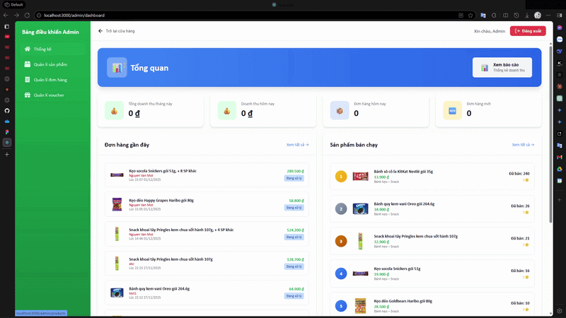
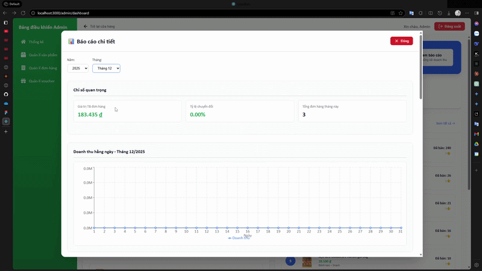
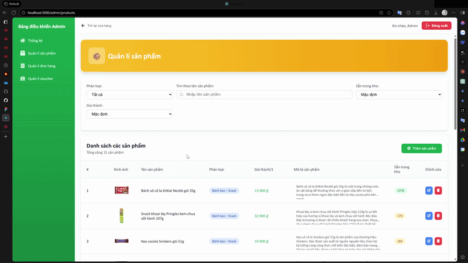
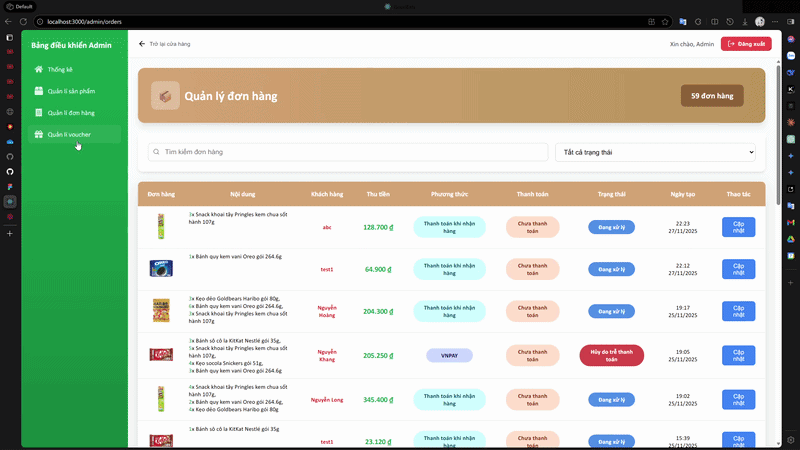
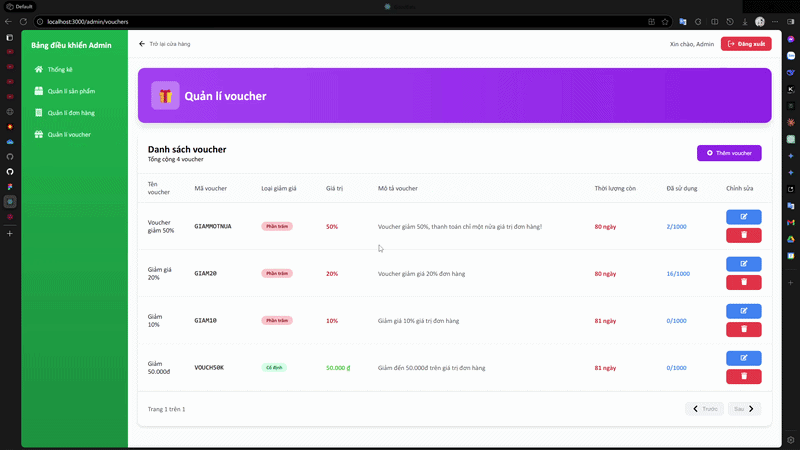
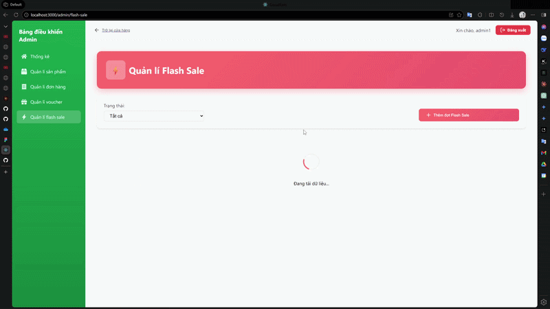

# EcomWebApp

A full-featured e-commerce web application built as a group project. The app supports two distinct user roles — **Customer** and **Admin** — each with their own set of features and views.

---

## Tech Stack

- **Frontend:** React, TypeScript, JavaScript, CSS
- **Tooling:** Vite / Node.js

---

## Getting Started

```bash
# Clone the repository
git clone https://github.com/DangHoangThanh/EcomWebApp.git
cd EcomWebApp/frontend

# Install dependencies
npm install

# Start the development server
npm start
```

---

## Features

### Customer

- **Browse Products** — View all available products on the homepage, filterable by category.
- **Product Details** — Click on a product to see its full description, images, and price.
- **Search** — Search for products by name or keyword.
- **Shopping Cart** — Add products to a cart, adjust quantities, and remove items.
- **Checkout** — Enter shipping information and place an order.
- **User Authentication** — Log in to an existing user account.
- **Order History** — View past orders and their statuses after logging in.
- **Profile Management** — Update personal information and account details.

---

### Admin (Fully Handled by DangHoangThanh)

- **Dashboard** — Overview of key store metrics (orders, revenue, users).


- **Product Management** — Create, edit, and delete products including images, pricing, and stock levels.

- **Order Management** — View all customer orders and update their status (e.g. pending, shipped, delivered).

- **Voucher Management** — Create, edit, and delete discount vouchers.

- **Sale Management** — Create, edit, and delete discount batches.


---

## Project Structure

```
EcomWebApp/
└── frontend/
    ├── src/
    │   ├── Admin/     # Seperate Admin pages and components
    │   ├── components/     # Reusable UI components
    │   ├── pages/          # Route-level page components (customer & admin views)
    │   ├── utils/          # Utilities for API fetching and data manipulation
    │   ├── assets/         # Images and static files
    │   └── ...
    ├── package.json
    └── ...
```

---

## Contributors

This project was developed as a group assignment. Hoang Thanh's fork is available at [github.com/DangHoangThanh/EcomWebApp](https://github.com/DangHoangThanh/EcomWebApp). The original group repository is at [github.com/SonTrinh235/E-commerce1.0](https://github.com/SonTrinh235/E-commerce1.0).